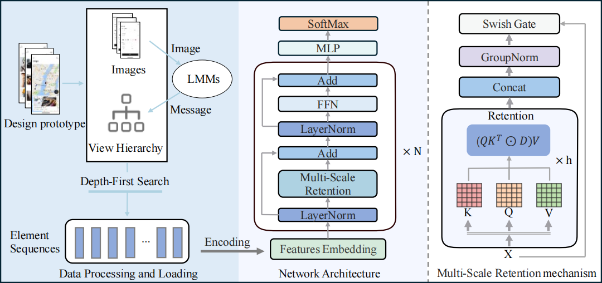

# MMNet

Pytorch implementation for MMNet: A Multi-Scale Multimodal Model for
End-to-End Grouping of Fragmented UI Elements.

### Abstract

Graphical User Interface (GUI) designs often result in fragmented elements, leading to inefficient and redundant code when automatically converted. This paper presents MMNet, a novel end-to-end model for grouping these fragmented elements,
leveraging multimodal feature representations and advanced retention mechanisms to improve grouping accuracy and efficiency.MMNet uses UI sequence prediction, enhanced by large multi-modal models, and a multi-scale retention mechanism to build a UI encoder. This approach captures temporal dependencies and multi-scale features, improving multimodal representation learning. MMNet introduces three key innovations: depth-first traversal for sequence extraction, enhanced small object detection through comprehensive attribute integration, and a novel data augmentation method using large multimodal models. The multi-scale retention mechanism further refines relationship modeling between UI elements. Evaluated on a dataset of 1,430 UI design prototypes, MMNet outperformed three state-of-the-art deep learning methods, demonstrating its effectiveness andinnovation. 



### Results

| Method          | ACC       | F1        | Precision | Recall    |
| --------------- | --------- | --------- | --------- | --------- |
| EfficientNet    | 0.799     | 0.636     | 0.637     | 0.636     |
| SwinTransformer | 0.769     | 0.575     | 0.550     | 0.612     |
| EGFE            | 0.853     | 0.738     | 0.735     | 0.748     |
| **MMNet(Ours)** | **0.890** | **0.760** | **0.773** | **0.757** |

### Requirements

```
pip install -r requirements.txt
```

### Usage

This is the Pytorch implementation of MMNet. It has been trained and tested on Linux (Ubuntu20 + Cuda 11.6 + Python 3.9 + Pytorch 1.13 + NVIDIA GeForce RTX 3090 GPU), and it can also work on Windows.

### Getting Started 

```
git clone https://github.com/ssea-lab/MMNet
cd MMnet
```

### Train Our Model

* Start to train with

  ```
  torchrun --nnodes 1 --nproc_per_node 1  main.py --batch_size 10 --lr 5e-4
  ```

### Test Our Model

* Start to test with

  ```
  torchrun --nnodes 1 --nproc_per_node 1  main.py --evaluate --resume ./work_dir/set-wei-05-0849/checkpoints/latest.pth --batch_size 40
  ```

### Baselines of UI Fragmented Element Classification

#### EfficientNet

* Start to train with

  ```
  torchrun --nnodes 1 --nproc_per_node 1  efficient_main.py --batch_size 4 --lr 5e-4
  ```

* Start to test with 

  ```
  torchrun --nnodes 1 --nproc_per_node 1  efficient_main.py --evaluate --resume ./work_dir/efficient_net/latest.pth --batch_size 8
  ```

#### Swin Transformer

- Start to train with

```
torchrun --nnodes 1 --nproc_per_node 1  sw_vit_main.py --batch_size 4 --lr 5e-4
```

- Start to test with

```
torchrun --nnodes 1 --nproc_per_node 1  sw_vit_main.py --evaluate --resume ./work_dir/swin/latest.pth --batch_size 8
```

### ACKNOWNLEDGES

The implementations of EfficientNet, Vision Transformer, and Swin Transformer are based on the following GitHub Repositories. Thank for the works.

- EfficientNet: https://github.com/lukemelas/EfficientNet-PyTorch
- Swin Transformer: https://github.com/microsoft/Swin-Transformer
